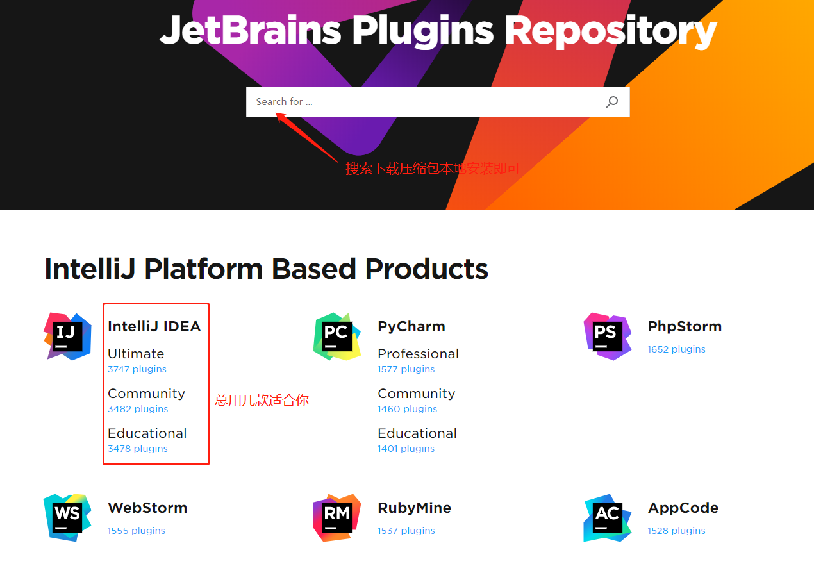
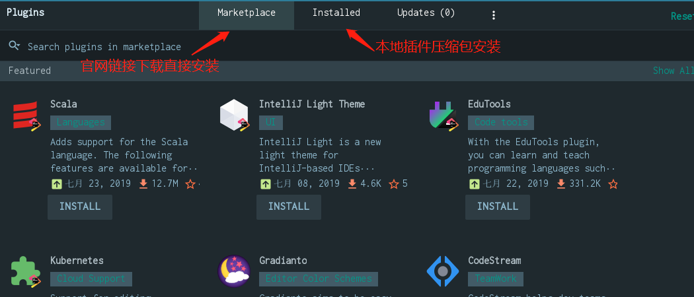
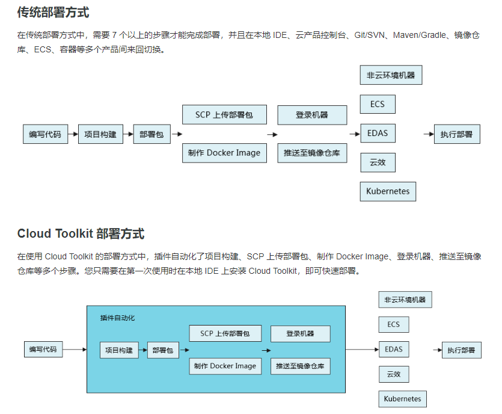
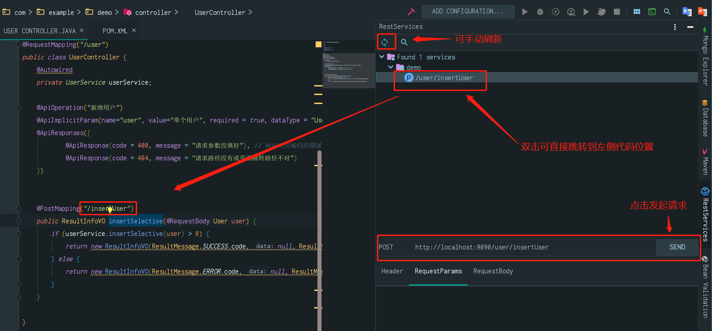
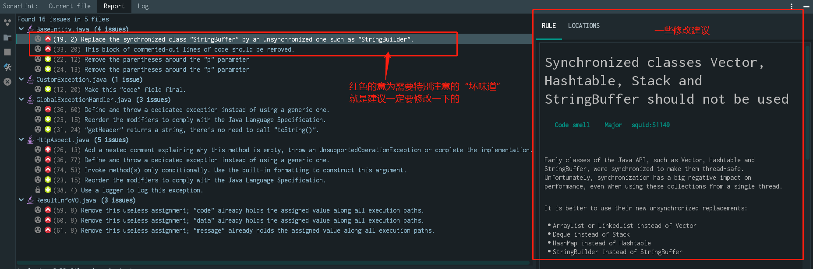

# (二) 日常开发本人常用idea插件分享
***
[TOC]
**多看[官方使用文档](https://www.jetbrains.com/help/idea/creating-and-optimizing-imports.html#disable-import-popups)还是很不错的~
IntelliJ IDEA的每个方面都专门设计用于最大化开发人员的工作效率。
强大的静态代码分析和符合人体工程学的设计使开发不仅具有高效性，而且还具有令人愉悦的体验。**

_插件库:_   [官网网址](http://plugins.jetbrains.com/) 

两种安装方式：

## 1.Alibaba Cloud Toolkit
> 简介：
Alibaba Cloud Toolkit （后文简称 Cloud Toolkit）是针对 IDE 平台为开发者提供的一款插件，用于帮助开发者更高效地开发、测试、诊断应用和部署应用。通过 Cloud Toolkit，您可以将应用部署到云端（ECS、EDAS、容器服务 Kubernetes 等云产品）和任意服务器中去；通过内嵌的 Arthas 程序诊断、 Terminal Shell 终端和 MySQL 执行器等工具，可以快速开发、测试和诊断应用。
** 简言之，可将web应用等，一键部署到阿里云服务器或任意服务器下，并执行相关后续操作。**
>> 1.1 传统部署方式
在传统部署方式中，需要 7 个以上的步骤才能完成部署，并且在本地 IDE、云产品控制台、Git/SVN、Maven/Gradle、镜像仓库、ECS、容器等多个产品间来回切换。

>> 1.2  Cloud Toolkit 部署方式(_优势_)
在使用 Cloud Toolkit 的部署方式中，插件自动化了项目构建、SCP 上传部署包、制作 Docker Image、登录机器、推送至镜像仓库等多个步骤。您只需要在第一次使用时在本地 IDE 上安装 Cloud Toolkit，即可快速部署。
>> 1.3 下载链接及官方使用教程
>>>[官网视频演示及相关内容介绍地址](https://www.aliyun.com/product/cloudtoolkit)
>>>[插件下载链接](http://plugins.jetbrains.com/plugin/11386-alibaba-cloud-toolkit)
## 2.Alibaba Java Coding Guidelines
>> 2.1 下载链接及官方使用教程（支持eclipse）
配合《阿里巴巴Java开发手册》还是很值的使用的~
>>> [源码地址](https://github.com/alibaba/p3c)
>>> [使用教程](https://github.com/alibaba/p3c/wiki/IDEA%E6%8F%92%E4%BB%B6%E4%BD%BF%E7%94%A8%E6%96%87%E6%A1%A3)
>>> [插件下载链接](http://plugins.jetbrains.com/plugin/10046-alibaba-java-coding-guidelines)
## 3.RestfulToolkit（需Spring体系）
>简介：一套 RESTful 服务开发辅助工具集。
>>1.根据 URL 直接跳转到对应的方法定义 ( Ctrl \ or Ctrl Alt N );
>>2.提供了一个 Services tree 的显示窗口;
>>3.一个简单的 http 请求工具;
>>4.在请求方法上添加了有用功能: 复制生成 URL;,复制方法参数...
>>5.其他功能: java 类上添加 Convert to JSON 功能，格式化 json 数据 ( Windows: Ctrl + Enter; Mac: Command + Enter )。
支持 Spring 体系 (Spring MVC / Spring Boot 1.x,2.x)
支持 JAX-RS
支持 Java 和 Kotlin 语言。

>3.1 效果图及使用方法

>3.2 插件下载地址
>>[插件下载链接](https://plugins.jetbrains.com/plugin/10292-restfultoolkit)
## 4.SonarLint
>简介：想不想身边有个“大神”指导你开发？它就可以满足你~不错的代码质量检测插件，帮你检测代码中的“坏味道~”。
>>[官网-需墙](https://www.sonarlint.org/) 
>>[博客-需墙](https://blog.sonarsource.com/)

>4.1 效果图

>4.2 插件下载地址
>> [插件下载链接](https://plugins.jetbrains.com/plugin/7973-sonarlint/)

## 5.其它插件
关于各个插件如何使用的问题，下载链接中一般都会有一些简单的gif演示；或自行按需要找一找便可，这里不一一赘述。

| 插件名称                   | 插件介绍                                                                        | 插件下载地址                                                              |
| ------------------------------ | ----------------------------------------------------------------------------------- | ------------------------------------------------------------------------- |
| Gitee                          | 开源中国的码云插件                                                         | https://plugins.jetbrains.com/plugin/8383-gitee                           |           
|                                |                                                                                     |                                                                           |
| IDE Features Trainer           | IntelliJ IDEA 官方出的学习辅助插件                                        | https://plugins.jetbrains.com/plugin/8554?pr=idea                         |
|                                |                                                                                     |                                                                           |
| Key promoter                   | 快捷键提示                                                                     | https://plugins.jetbrains.com/plugin/4455?pr=idea                         |
|                                |                                                                                     |                                                                           |
| Grep Console                   | 自定义设置控制台输出颜色                                                | https://plugins.jetbrains.com/idea/plugin/7125-grep-console               |
|                                |                                                                                     |                                                                           |
| String Manipulation            | 驼峰式命名和下划线命名交替变化                                       | https://plugins.jetbrains.com/plugin/2162?pr=idea                         |
|                                |                                                                                     |                                                                           |
| CheckStyle-IDEA                | 代码规范检查                                                                  | https://plugins.jetbrains.com/plugin/1065?pr=idea                         |
|                                |                                                                                     |                                                                           |
| FindBugs-IDEA                  | 潜在 Bug 检查                                                                   | https://plugins.jetbrains.com/plugin/3847?pr=idea                         |
|                                |                                                                                     |                                                                           |
| MetricsReloaded                | 代码复杂度检查                                                               | https://plugins.jetbrains.com/plugin/93?pr=idea                           |
|                                |                                                                                     |                                                                           |
| Statistic                      | 代码统计                                                                        | https://plugins.jetbrains.com/plugin/4509?pr=idea                         |
|                                |                                                                                     |                                                                           |
| JRebel Plugin                  | 热部署                                                                           | https://plugins.jetbrains.com/plugin/?id=4441                             |
|                                |                                                                                     |                                                                           |
| CodeGlance                     | 在编辑代码最右侧，显示一块代码小地图                              | https://plugins.jetbrains.com/plugin/7275?pr=idea                         |
|                                |                                                                                     |                                                                           |
| GsonFormat                     | 把 JSON 字符串直接实例化成类                                             | https://plugins.jetbrains.com/plugin/7654?pr=idea                         |
|                                |                                                                                     |                                                                           |
| Markdown Navigator             | 书写 Markdown 文章                                                              | https://plugins.jetbrains.com/plugin/7896?pr=idea                         |
|                                |                                                                                     |                                                                           |
| Eclipse Code Formatter         | 使用 Eclipse 的代码格式化风格，在一个团队中如果公司有规定格式化风格，这个可以使用。 | https://plugins.jetbrains.com/plugin/6546?pr=idea                         |
|                                |                                                                                     |                                                                           |
| Jindent-Source Code Formatter  | 自定义类、方法、doc、变量注释模板                                    | http://plugins.jetbrains.com/plugin/2170?pr=idea                          |
|                                |                                                                                     |                                                                           |
| Translation                    | 翻译插件                                                                        | https://github.com/YiiGuxing/TranslationPlugin                            |
|                                |                                                                                     |                                                                           |
| Maven Helper                   | Maven 辅助插件                                                                  | https://plugins.jetbrains.com/plugin/7179-maven-helper                    |
|                                |                                                                                     |                                                                           |
| Properties to YAML Converter   | 把 Properties 的配置格式改为 YAML 格式                                    | https://plugins.jetbrains.com/plugin/8000-properties-to-yaml-converter    |
|                                |                                                                                     |                                                                           |
| Git Flow Integration           | Git Flow 的图形界面操作                                                      | https://plugins.jetbrains.com/plugin/7315-git-flow-integration            |
|                                |                                                                                     |                                                                           |
| Rainbow Brackets               | 对各个对称括号进行着色，方便查看                                    | https://github.com/izhangzhihao/intellij-rainbow-brackets                 |
|                                |                                                                                     |                                                                           |
| Free Mybatis plugin                       | xml与mapper间跳转（免费）                                                    | https://plugins.jetbrains.com/plugin/8321-free-mybatis-plugin                      |
|                                |                                                                                     |                                                                           |
| Lombok Plugin                  | Lombok 功能辅助插件（@Data等）                                                           | https://plugins.jetbrains.com/plugin/6317-lombok-plugin                   |
|                                |                                                                                     |                                                                           |
| .ignore                        | 各类版本控制忽略文件生成工具                                          | https://plugins.jetbrains.com/plugin/7495--ignore                         |
|                                |                                                                                     |                                                                           |
| mongo4idea                     | mongo客户端                                                                      | https://github.com/dboissier/mongo4idea                                   |
|                                |                                                                                     |                                                                           |
| iedis                          | redis客户端                                                                      | https://plugins.jetbrains.com/plugin/9228-iedis                           |
|                                |                                                                                     |                                                                           |
| GenerateAllSetter              | new POJO类的快速生成 set 方法                                               | https://plugins.jetbrains.com/plugin/9360-generateallsetter               |
|                                |                                                                                     |                                                                           |
| MyBatis Log Plugin | 将 Mybatis 执行的 sql 脚本显示出来，无需处理，可以直接复制出来执行的 |https://plugins.jetbrains.com/plugin/10065-mybatis-log-plugin | | | | stackoverflow | 这一看似平淡的右键 stackoverflow，却把其中的闷骚体现的淋漓尽致：我就这么叼，我就不去浏览器里查，只有右键才和我的右手匹配。 |https://plugins.jetbrains.com/plugin/9513-stackoverflow | | | | Nyan progress bar | 普通的人进度条都太普通，我的精致要装扮到每一个细节，包括进度条！ |https://plugins.jetbrains.com/plugin/8575-nyan-progress-bar | | activate-power-mode | 炫酷的输入效果（带震动效果）同类型的还有冒火焰的 Power Mode II |https://plugins.jetbrains.com/plugin/8330-activate-power-mode | | Material Theme UI | Material Theme UI 是 JetBrains IDE（IntelliJ IDEA，WebStorm，Android Studio 等）的插件，可将原始外观更改为 Material Design 外观。 |https://plugins.jetbrains.com/plugin/8006-material-theme-ui
